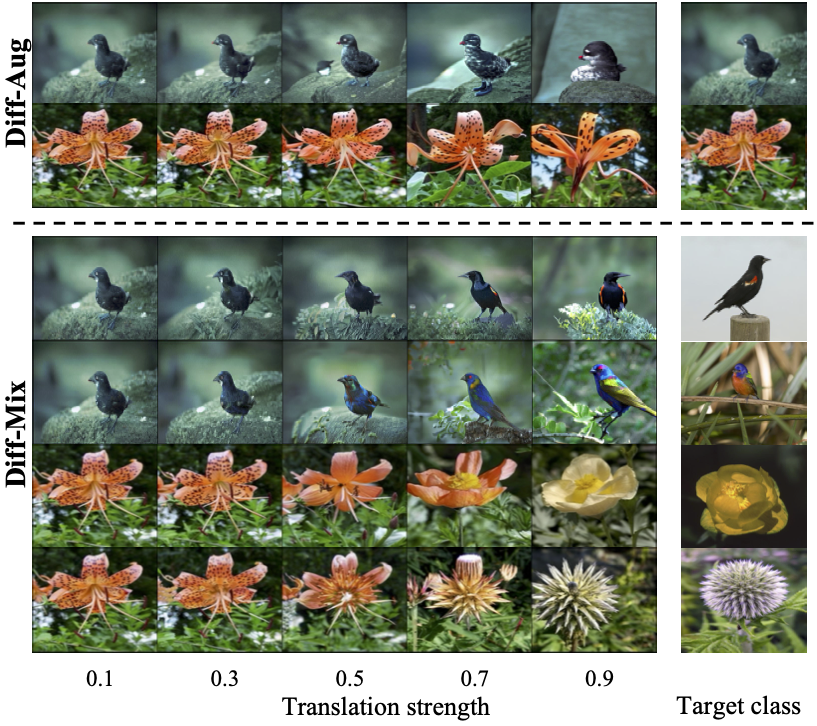

<!-- [](https://github.com/Zhicaiwww/github-readme-stats) -->
<p align="center">

  <h2 align="center">Mejorar la Clasificación de Imágenes Mediante la Mezcla de Imágenes Interclase con un Modelo de Difusión</h2>
  <p align="center">
        <a href="https://arxiv.org/abs/2403.19600"></a>
  </p>
  
<div align="center">
  
</div>

## Introducción 👋
Este repositorio implementa varias estrategias de **aumento generativo de datos** utilizando stable diffusion para crear conjuntos de datos sintéticos, orientados a mejorar las tareas de clasificación.

## Requisitos
Los paquetes clave y sus versiones se enumeran a continuación. El código ha sido probado en un nodo con 4 GPUs NVIDIA RTX3090.
```
torch==2.0.1+cu118
diffusers==0.25.1
transformers==4.36.2
datasets==2.16.1
accelerate==0.26.1
numpy==1.24.4
```

## Conjuntos de Datos 
Para mayor comodidad, se pueden utilizar conjuntos de datos bien estructurados en Hugging Face. Los conjuntos de datos de fine-grained `CUB` y `Aircraft` con los que experimentamos se pueden descargar de [Multimodal-Fatima/CUB_train](https://huggingface.co/datasets/Multimodal-Fatima/CUB_train) y [Multimodal-Fatima/FGVC_Aircraft_train](https://huggingface.co/datasets/Multimodal-Fatima/FGVC_Aircraft_train), respectivamente. En caso de encontrar problemas de conexión de red durante el entrenamiento, descargue previamente los datos desde el sitio web, y la ruta local guardada `HUG_LOCAL_IMAGE_TRAIN_DIR` debe especificarse en `dataset/instance/cub.py`. 

## Ajuste fino en un conjunto de datos 🔥
### Pesos LoRA pre-entrenados
Proporcionamos los pesos LoRA ajustados en el conjunto de datos completo para facilitar una reproducción rápida en los conjuntos de datos indicados. Se puede descargar utilizando el siguiente enlace, y descomprimir el archivo en el directorio `ckpts`, de modo que la estructura de archivos se vea así:

```
ckpts
├── cub                                                                                                                                                                                                                                          -packages/torch/nn/modules/module.py", line 1501, in _call_impl
│   └── shot-1-lora-rank10
│       ├── learned_embeds-steps-last.bin                                                                                                                                                                                                        -packages/diffusers/models/attention_processor.py", line 527, in forward
│       └── pytorch_lora_weights.safetensors
└── put_finetuned_ckpts_here.txt
```

| Dataset | data | ckpts (fullshot) |
|---------|------|------------------|
| CUB | huggingface ([train](https://huggingface.co/datasets/Multimodal-Fatima/CUB_train)/[test](https://huggingface.co/datasets/Multimodal-Fatima/CUB_test))| [google drive](https://drive.google.com/file/d/1AOX4TcXSPGRSmxSgB08L8P-28c5TPkxw/view?usp=sharing) |
| Flower | [sitio web oficial ](https://www.robots.ox.ac.uk/~vgg/data/flowers/102/) | [google drive](https://drive.google.com/file/d/1hBodBaLb_GokxfMXvQyhr4OGzyBgyBm0/view?usp=sharing) |
| Aircraft | huggingface ([train](https://huggingface.co/datasets/Multimodal-Fatima/FGVC_Aircraft_train)/[test](https://huggingface.co/datasets/Multimodal-Fatima/FGVC_Aircraft_test)) | [google drive](https://drive.google.com/file/d/19PuRbIsurv1IKeu-jx5WieocMy5rfIKg/view?usp=sharing) |

### Ajuste fino personalizado
El script `scripts/finetune.sh` permite a los usuarios realizar el ajuste fino en sus propios conjuntos de datos. De forma predeterminada, implementa una estrategia de ajuste fino que combina `DreamBooth` y `Textual Inversion`. Los usuarios pueden personalizar el argumento `examples_per_class` para ajustar el modelo en un conjunto de datos con {examples_per_class} disparos por clase. El proceso de ajuste dura aproximadamente 4 horas en 4 GPUs RTX3090 para el conjunto de datos `cub` completo.

```
MODEL_NAME="runwayml/stable-diffusion-v1-5"
DATASET='cub'
SHOT=-1 # set -1 for full shot
OUTPUT_DIR="ckpts/${DATASET}/shot${SHOT}_lora_rank10"

accelerate launch --mixed_precision='fp16' --main_process_port 29507 \
    train_lora.py \
    --pretrained_model_name_or_path=$MODEL_NAME \
    --dataset_name=$DATASET \
    --resolution=224 \
    --random_flip \
    --max_train_steps=35000 \
    --num_train_epochs=10 \
    --checkpointing_steps=5000 \
    --learning_rate=5e-05 \
    --lr_scheduler='constant' \
    --lr_warmup_steps=0 \
    --seed=42 \
    --rank=10 \
    --local_files_only \
    --examples_per_class $SHOT  \
    --train_batch_size 2 \
    --output_dir=$OUTPUT_DIR \
    --report_to='tensorboard'"
```

## Generación de datos sintéticos
`scripts/sample.sh` proporciona un script para sintetizar imágenes aumentadas de manera multiproceso. Cada elemento en `GPU_IDS` denota el proceso que se ejecuta en la GPU indexada. El comando simplificado para muestrear un subconjunto sintético $5\times$ de manera de traducción interclase (`diff-mix`) con una fuerza $s=0.7$ es:

```bash
DATASET='cub'
# set -1 for full shot
SHOT=-1 
FINETUNED_CKPT="ckpts/cub/shot${SHOT}-lora-rank10"
# ['diff-mix', 'diff-aug', 'diff-gen', 'real-mix', 'real-aug', 'real-gen', 'ti_mix', 'ti_aug']
SAMPLE_STRATEGY='diff-mix' 
STRENGTH=0.8
# ['fixed', 'uniform']. 'fixed': use fixed $STRENGTH, 'uniform': sample from [0.3, 0.5, 0.7, 0.9]
STRENGTH_STRATEGY='fixed' 
# expand the dataset by 5 times
MULTIPLIER=5 
# spwan 4 processes
GPU_IDS=(0 1 2 3) 

python  scripts/sample_mp.py \
--model-path='runwayml/stable-diffusion-v1-5' \
--output_root='outputs/aug_samples' \
--dataset=$DATASET \
--finetuned_ckpt=$FINETUNED_CKPT \
--syn_dataset_mulitiplier=$MULTIPLIER \
--strength_strategy=$STRENGTH_STRATEGY \
--sample_strategy=$SAMPLE_STRATEGY \
--examples_per_class=$SHOT \
--resolution=512 \
--batch_size=1 \
--aug_strength=0.8 \
--gpu-ids=${GPU_IDS[@]}
```
El directorio de salida sintético se ubicará en `aug_samples/cub/diff-mix_-1_fixed_0.7`. Para crear una configuración de 5 disparos, establezca el argumento `examples_per_class` en 5 y el directorio de salida estará en `aug_samples/cub/diff-mix_5_fixed_0.7`. Asegúrese de que el `finetuned_ckpt` también esté ajustado en la misma configuración de 5 disparos.

## Clasificación downstream
Una vez completado el proceso de muestreo, puede integrar los datos sintéticos en la clasificación downstream e iniciar el entrenamiento utilizando el script `scripts/classification.sh`:
```
GPU=1
DATASET="cub"
SHOT=-1
# "shot{args.examples_per_class}_{args.sample_strategy}_{args.strength_strategy}_{args.aug_strength}"
SYNDATA_DIR="aug_samples/cub/shot${SHOT}_diff-mix_fixed_0.7" # shot-1 denotes full shot
SYNDATA_P=0.1
GAMMA=0.8

python downstream_tasks/train_hub.py \
    --dataset $DATASET \
    --syndata_dir $SYNDATA_DIR \
    --syndata_p $SYNDATA_P \
    --model "resnet50" \
    --gamma $GAMMA \
    --examples_per_class $SHOT \
    --gpu $GPU \
    --amp 2 \
    --note $(date +%m%d%H%M) \
    --group_note "fullshot" \
    --nepoch 120 \
    --res_mode 224 \
    --lr 0.05 \
    --seed 0 \
    --weight_decay 0.0005 
```

También proporcionamos los scripts para las pruebas de robustez y la clasificación de larga cola en `scripts/classification_waterbird.sh` y `scripts/classification_imb.sh`, respectivamente.

## Agradecimientos

Este proyecto se basa en el repositorio [Da-fusion](https://github.com/brandontrabucco/da-fusion) y [diffusers](https://github.com/huggingface/diffusers). Un agradecimiento especial a los contribuyentes.
