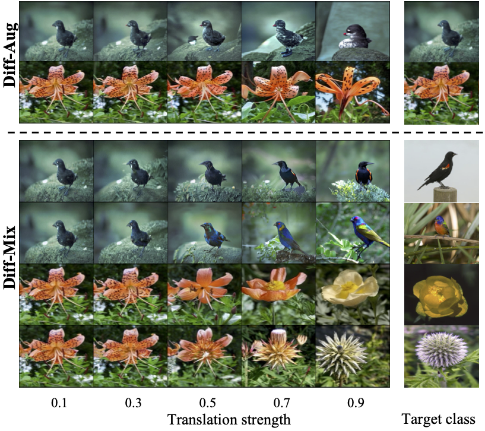

<!-- [](https://github.com/Zhicaiwww/github-readme-stats) -->
<p align="center">

  <h2 align="center">Enhance Image Classification Via Inter-Class Image Mixup With Diffusion Model</h2>
  <p align="center">
        <a href="https://arxiv.org/abs/2403.19600"></a>
  </p>
  
<div align="center">
  
</div>

## Introduction 👋
This repository implements various **generative data augmentation** strategies using stable diffusion to create synthetic datasets, aimed at enhancing classification tasks.
## Requirements
The key packages and their versions are listed below. The code is tested on a single node with 4 NVIDIA RTX3090 GPUs.
```
torch==2.0.1+cu118
diffusers==0.25.1
transformers==4.36.2
datasets==2.16.1
accelerate==0.26.1
numpy==1.24.4
```
## Datasets 
For convenience, well-structured datasets in Hugging Face can be utilized. The fine-grained datasets `CUB` and `Aircraft` we experimented with can be downloaded from [Multimodal-Fatima/CUB_train](https://huggingface.co/datasets/Multimodal-Fatima/CUB_train) and [Multimodal-Fatima/FGVC_Aircraft_train](https://huggingface.co/datasets/Multimodal-Fatima/FGVC_Aircraft_train), respectively. In case of encountering network connection problem during training, please pre-download the data from the website, and the saved local path `HUG_LOCAL_IMAGE_TRAIN_DIR` should be specified in the `dataset/instance/cub.py`. 


## Fine-tune on a dataset 🔥
### Pre-trained lora weights
We provide the lora weights fine-tuned on the full dataset in case for fast reproducation on given datasets. One can download using the following link, and unzip the file into dir `ckpts` and the file structure look like:

```
ckpts
├── cub                                                                                                                                                                                                                                          -packages/torch/nn/modules/module.py", line 1501, in _call_impl
│   └── shot-1-lora-rank10
│       ├── learned_embeds-steps-last.bin                                                                                                                                                                                                        -packages/diffusers/models/attention_processor.py", line 527, in forward
│       └── pytorch_lora_weights.safetensors
└── put_finetuned_ckpts_here.txt
```

| Dataset | data                                                             | ckpts (fullshot)                                                    |
|---------|---------------------------------------------------------------------|---------------------------------------------------------------------|
| CUB     | huggingface ([train](https://huggingface.co/datasets/Multimodal-Fatima/CUB_train)/[test](https://huggingface.co/datasets/Multimodal-Fatima/CUB_test))| [google drive](https://drive.google.com/file/d/1AOX4TcXSPGRSmxSgB08L8P-28c5TPkxw/view?usp=sharing) |
| Flower  | [official website ](https://www.robots.ox.ac.uk/~vgg/data/flowers/102/) | [google drive](https://drive.google.com/file/d/1hBodBaLb_GokxfMXvQyhr4OGzyBgyBm0/view?usp=sharing) |
| Aircraft  | huggingface ([train](https://huggingface.co/datasets/Multimodal-Fatima/FGVC_Aircraft_train)/[test](https://huggingface.co/datasets/Multimodal-Fatima/FGVC_Aircraft_test)) | [google drive](https://drive.google.com/file/d/19PuRbIsurv1IKeu-jx5WieocMy5rfIKg/view?usp=sharing) |


### Customized fine-tuning
The `scripts/finetune.sh` script allows users to perform fine-tuning on their own datasets. By default, it implements a fine-tuning strategy combining `DreamBooth` and `Textual Inversion`. Users can customize the `examples_per_class` argument to fine-tune the model on a dataset with {examples_per_class} shots. The tuning process costs around 4 hours on 4 RTX3090 GPUs for full-shot cub dataset.

```
MODEL_NAME="runwayml/stable-diffusion-v1-5"
DATASET='cub'
SHOT=-1 # set -1 for full shot
OUTPUT_DIR="ckpts/${DATASET}/shot${SHOT}_lora_rank10"

accelerate launch --mixed_precision='fp16' --main_process_port 29507 \
    train_lora.py \
    --pretrained_model_name_or_path=$MODEL_NAME \
    --dataset_name=$DATASET \
    --resolution=224 \
    --random_flip \
    --max_train_steps=35000 \
    --num_train_epochs=10 \
    --checkpointing_steps=5000 \
    --learning_rate=5e-05 \
    --lr_scheduler='constant' \
    --lr_warmup_steps=0 \
    --seed=42 \
    --rank=10 \
    --local_files_only \
    --examples_per_class $SHOT  \
    --train_batch_size 2 \
    --output_dir=$OUTPUT_DIR \
    --report_to='tensorboard'"
```

## Contruct synthetic data
`scripts/sample.sh` provides script to synthesize augmented images in a multi-processing way. Each item in `GPU_IDS` denotes the process running on the indexed GPU. The simplified command for sampling a $5\times$ synthetic subset in an inter-class translation manner (`diff-mix`) with strength $s=0.7$ is:

```bash
DATASET='cub'
FINETUNED_CKPT='ckpts/cub/shot-1-lora-rank10' 
# set -1 for full shot
SHOT=-1 
# ['diff-mix', 'diff-aug', 'diff-gen', 'real-mix', 'real-aug', 'real-gen', 'ti_mix', 'ti_aug']
SAMPLE_STRATEGY='diff-mix' 
STRENGTH=0.7
# ['fixed', 'uniform']. 'fixed': use fixed $STRENGTH, 'uniform': sample from [0.3, 0.5, 0.7, 0.9]
STRENGTH_STRATEGY='fixed' 
# expand the dataset by 5 times
MULTIPLIER=5 
# spwan 4 processes
GPU_IDS=(0 1 2 3) 

python  scripts/sample_mp.py \
--model-path='runwayml/stable-diffusion-v1-5' \
--output_root='aug_samples' \
--dataset=$DATASET \
--finetuned_ckpt=$FINETUNED_CKPT \
--syn_dataset_mulitiplier=$MULTIPLIER \
--strength_strategy=$STRENGTH_STRATEGY \
--sample_strategy=$SAMPLE_STRATEGY \
--examples_per_class=$SHOT \
--resolution=512 \
--batch_size=1 \
--aug_strength=0.8 \
--gpu-ids=${GPU_IDS[@]}
```
The output synthetic dir will be located at `aug_samples/cub/diff-mix_-1_fixed_0.7`. To create a 5-shot setting, set the `examples_per_class` argument to 5 and the output dir will be at `aug_samples/cub/diff-mix_5_fixed_0.7`. Please ensure that the `finetuned_ckpt` is also fine-tuned under the same 5-shot setting.


## Downstream classification
After completing the sampling process, you can integrate the synthetic data into downstream classification and initiate training using the script `scripts/classification.sh`:
```
GPU=1
DATASET="cub"
SYNDATA_DIR="aug_samples/cub/diff-mix_-1_fixed_0.7"
SYNDATA_P=0.1 # The proportion of syndata in all training samples
GAMMA=0.8 # label smoothing factor for syndata

python downstream_tasks/train_hub.py \
    --dataset $DATASET \
    --syndata_key $SYNDATA_KEY \
    --syndata_p $SYNDATA_P \
    --model "resnet50" \
    --gamma $GAMMA \
    --examples_per_class -1 \
    --gpu $GPU \
    --amp 2 \
    --note $(date +%m%d%H%M) \
    --group_note "fullshot" \
    --nepoch 120 \
    --res_mode 224 \
    --lr 0.05 \
    --seed 0 \
    --weight_decay 0.0005 
```

## Acknowledgements

This project is built upon the repository [Da-fusion](https://github.com/brandontrabucco/da-fusion) and [diffusers](https://github.com/huggingface/diffusers). Special thanks to the contributors.


